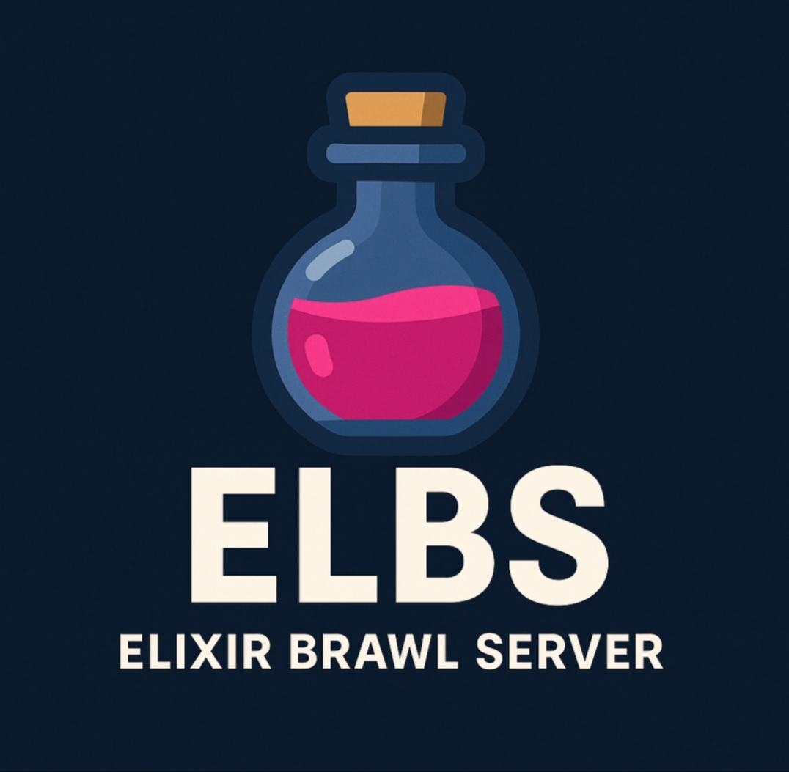

# Elixir Brawl Server (ELBS‑V30)

A simple Brawl Stars v30.242 server emulator written in Python.



---

## Requirements

- **Python 3.7+** (PC) or **Pydroid 3** (Android)  
- **colorama** → `pip install colorama`  
- **TinyDB** → `pip install tinydb`

---

## Available Clients

To play, you need a patched client. Choose one of the following:

- [ELBS V30 Default Client](https://example.com/default-client.apk)  
- [ELBS V30 No-Tutorial Client](https://example.com/no-tutorial-client.apk)

> *Replace IP inside `libcb.config.so` with `127.0.0.1` for local use or your network IPv4 for LAN play.*

---

## How to Run

1. Clone the repository:
   ```bash
   git clone https://github.com/yourusername/ELBS-V30.git
   cd ELBS-V30
   ```

2. Install the required modules:
   ```bash
   pip install colorama tinydb
   ```

3. Launch the server:
   ```bash
   python main.py
   ```

---

## Need Help?

Join our Discord for support and updates:  
[https://discord.gg/your-invite-code](https://discord.gg/your-invite-code)

---

## Credits

- **Classic Brawl Team** – for the original base (https://github.com/PhoenixFire6934)  
- **BreadDEV** – for various server modifications  
- **RicoDEV** – for patches, TinyDB rewrite, bytestream adjustment, and packet fixes

---

## License

This project is licensed under the MIT License.
